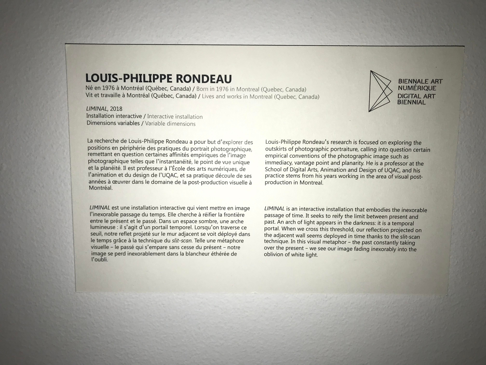
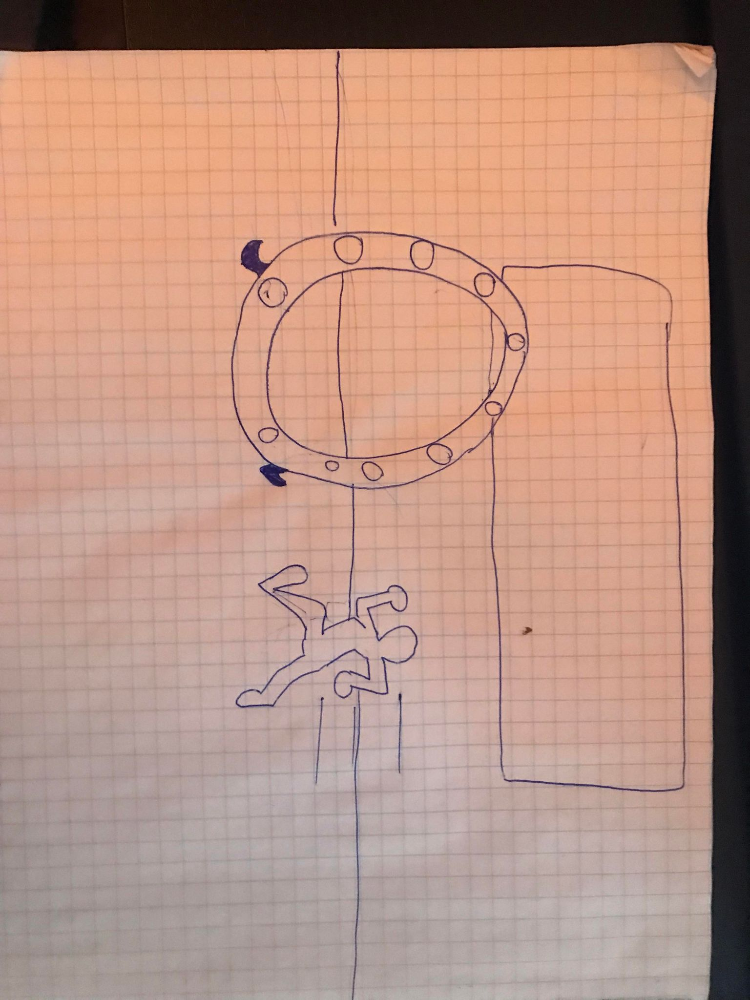
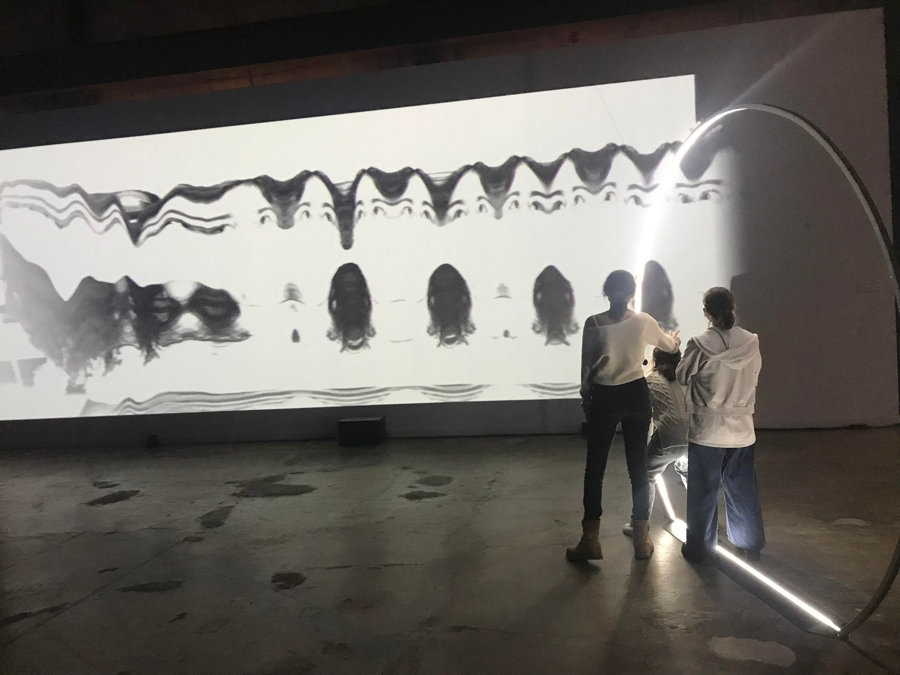

# Titre de l'oeuvre ou de la réalisation
## Liminal, 2018

## Nom de l'artiste ou de la firme
Louis-Philippe Rondeau

## Année de réalisation
2018

## Nom de l'exposition ou de l'événement
Arsenal art contemporain.

## Lieu de mise en exposition
Aresnal art contemporain.

## Date de votre visite
9 février 2022.

## Description de l'oeuvre ou du dispositif multimédia (à composer ou reprendre la description offerte sur le site de l'artiste ou le cartel de l'exposition en citant bien sa source)

Ce texte est tiré du cartel d'exposition Arsenal art contemporain Montréal.

## Explications sur la mise en espace de l'oeuvre ou du dispositif (texte à composer)
L'oeuvre met en avant l'intégration de différentes technologies. On y intègre des jeux de lumière, de sons et d'art graphiques. Les gens traversent un cercle lumineux qui diffuse un stop-motion d'eux-mêmes sur un mur. Elle donne l'impression de se téléporter dans un autre univers.

## Liste des composantes et techniques de l'oeuvre ou du dispositif 

C'est une installation intéractive qui se compose d'un anneau lumineux en aluminium, une caméra USB sur le côté de l'anneau, un projecteur HD pour diffuser les photos en mouvements des gens, divers câbles et adaptateurs audio et video, une paire d'enceintes amplifiées et un écran de projection pour le projeter sur le mur.

## EXPÉRIENCE VÉCUE :
❤️ Ce qui vous a plu, vous a donné des idées et justifications

J'ai apprécié cette expérience. Avoir mélangé l'audio avec le visuel était une bonne idée, car on pouvait s'imaginer qu'on se projeter dans une autre dimension. De plus, le design avec les lumières autour avait un air futuriste ce qui rendait l'installation plus crédible et extraordinaire.

 ## Description de votre expérience de l'oeuvre ou du dispositif, de l'interactivité, des gestes à poser, etc.
D'ailleurs, l'oeuvre était une installation bien pensée, car l'anneau ajoutait une bonne touche futuriste.  L'interaction aussi était réussie. Ça insistait les gens à essayer et apprécier l'oeuvre pour sa composition artistique et technique. On devait rentrer dans l'anneau qui diffusait une photo en noir et blanc de nous dans un projecteur sur le mur.
 

## 🤔 Aspect que vous ne souhaiteriez pas retenir pour vos propres créations ou que vous feriez autrement et justifications

Je pense que j'aurai fait plus par contre. Ce qui veut dire que j'aurai rajouté plus de diffusions d'images exemple: l'espace ou un monde inconnu.  Pareille pour les sons. J’aurai rajouté beaucoup plus pour donner une meilleure expérience. 

Références
