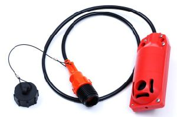
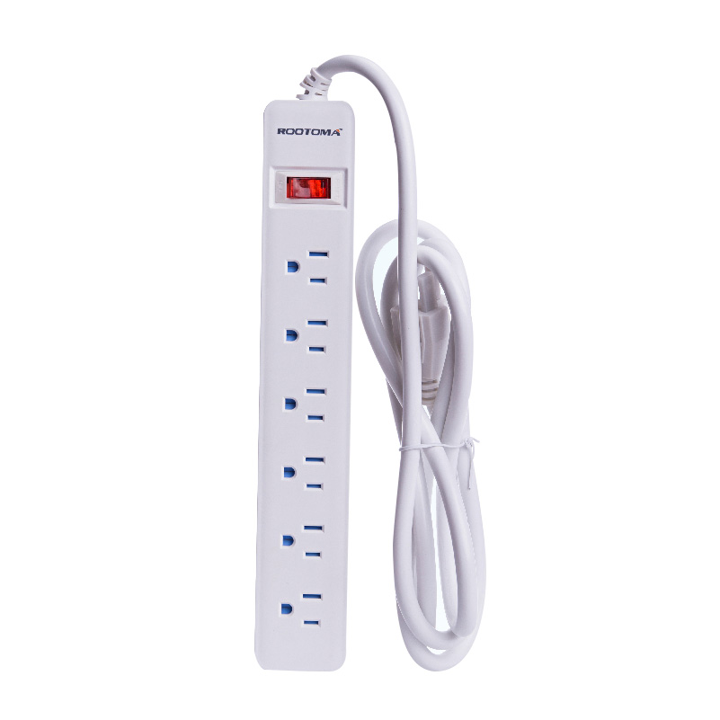
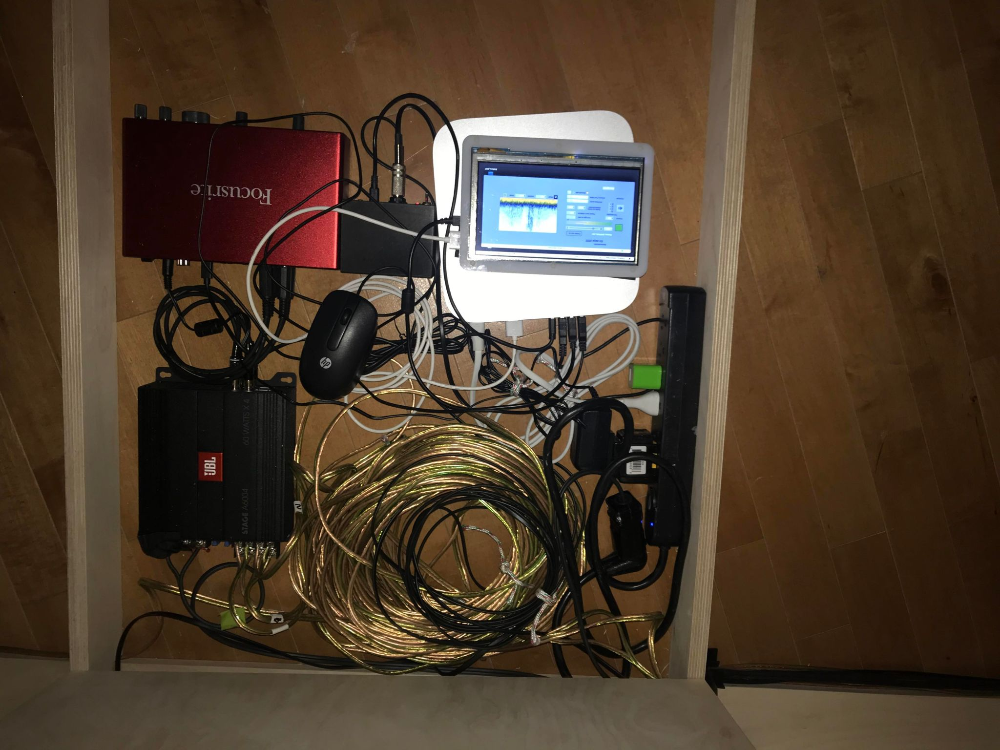
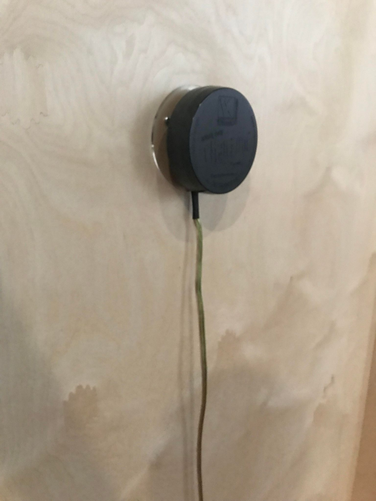

 # Titre de l'oeuvre ou de la réalisation
 ## L'en deçà

 # Nom de l'artiste ou de la firme
 ## Aseman Sabet
 

 # Année de réalisation
 ## 2022

 # Nom de l'exposition ou de l'événement
 ## 2022 Configurations du sensible, 

 # Lieu de mise en exposition
 ## Salle Alfred Pellan, Maison des arts de Laval, Québec, Canada.

 # Date de votre visite
 ## 16 mars -2022
 

 # Description de l'oeuvre ou du dispositif multimédia 
 
 ## Ce texte est tiré du cartel d'exposition Bechard Hudon à la Salle Alfred-Pellan de la maison des arts de Laval.

 # Explications sur la mise en espace de l'oeuvre ou du dispositif (texte à composer)
 
 ## L'en decà est une oeuvre immersive qui est composée de plusieurs surfaces murales fesant sortir des sons d'eau ou d'echo d'une cavité. Cette création est d'ailleurs interactive vu qu'elle laisse aux utilisateurs de toucher  et de sentir la vibration des murs. Son but est de laisser aux  spectateurs s'imaginer l'environnement dans lequel ils se perçoivent. D'ailleurs, les sons  sont projettes hors des murs en hauteur afin que l'expérience soit plus immersif. Ils sortiraient d'un peu partout. Ces mêmes sonorités seraient  amplifiées pour qu'elles paraissent plus fortes et  claires possible. De plus, elles sont enregistrées sous l'eau et les artistes ont utilisé un géophone pour capter les vibrations du sol. Donc, ce sont des bruits qui ne sont pas à la première écoute évidente à identifier. Elle laisse donc le mystère aux spectateurs.

 # Liste des composantes et techniques de l'oeuvre ou du dispositif 
 
 ## Cette installtion comprend une carte de sons Focusride qui permet de diffuser le son via des amplificateurs.
 
  
 
 
 ## Il y a aussi des transducteurs qui communiquent aux structures des échos sonores.
 
   
 
 ## un Hydrophone et géophone qui enregistres les sons des echos de la mer et de la terre proche de Sept-île et Kegaska.
 
  

 
 ## Évidemment il ya des fils qui de brachments qui permettent de brancher le tout avec une extension.
 
   
 

 # Liste des éléments nécessaires pour la mise en exposition (ex. : crochets, sac de sable, câbles de soutien...)
Pour que le l'expérience soit remarquable, il fallait obligatoirement que la carte de son ainsi que tous les amplificateurs fonctionnent bien . Sinon l'expérience ne serait pas immersive.

  
  
  
  
  

 # Expérience vécue : 
 
 ## Pour ma part, j'ai tout de même apprécié. J'ai adoré l'aspect immersif qu'il avait à travers l'oeuvre. C'est comme si l’on rentrait dans un monde inconnu avec des sons un peu partout. On ne sait pas où on est. On s'imagine justement le lieu où se trouve. C'était l'intention des artistes d'ailleurs à nous faire imaginer.

 # Description de votre expérience de l'oeuvre ou du dispositif, de l'interactivité, des gestes à poser, etc.

 # Ce qui vous a plu, vous a donné des idées et justificationsà
 
 ## J'ai aimé la façon que l'oeuvre donne aspect d'immersion avec les sons et les vibrations des murs. De plus, j'ai aussi apprécié la manière qu’ elle est reproduite. Le fait de rentrer à travers les murs était bien pensé pour montrer cette sensation de rentrer dans un nouveau monde. 

 # Aspect que vous ne souhaiteriez pas retenir pour vos propres créations ou que vous feriez autrement et justifications
 
 ## Je pense personnellement que j'aurai rajouté des diffusions d'images numériques sur les murs  pour rendre l'expérience encore plus immersive. Les murs manquaient de vie. C'était trop fade.

 Références
