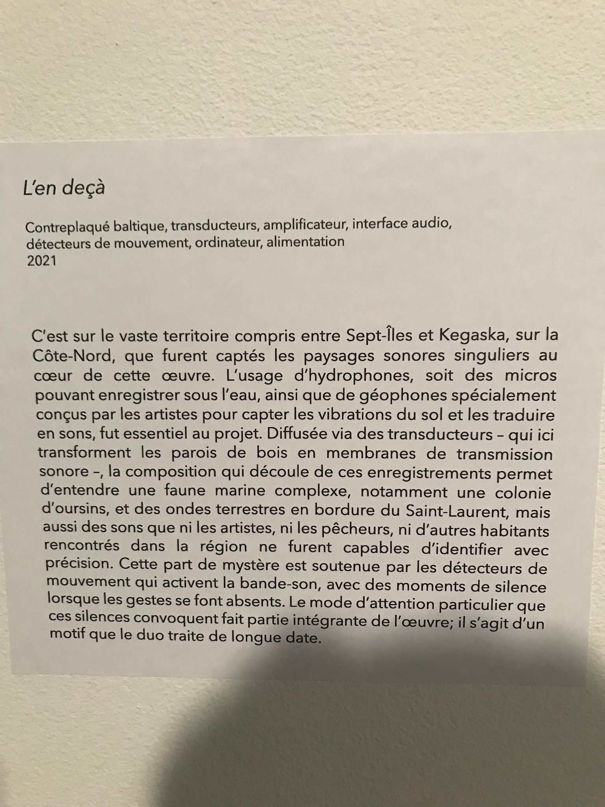
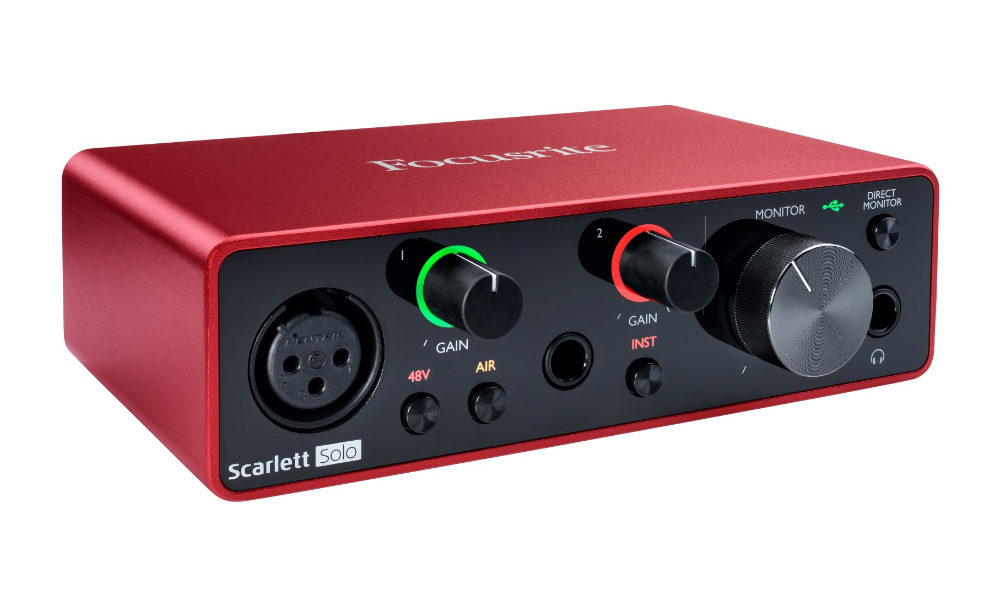
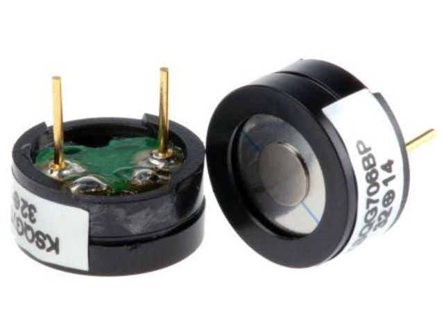

 # Titre de l'oeuvre ou de la réalisation
 ## L'en deçà

 # Nom de l'artiste ou de la firme
 ## Aseman Sabet
 

 # Année de réalisation
 ## 2022

 Nom de l'exposition ou de l'événement
 2022 Configurations du sensible, 

 # Lieu de mise en exposition
 ## Salle Alfred Pellan, Maison des arts de Laval, Québec, Canada.

 # Date de votre visite
 ## 16 mars -2022
 

 # Description de l'oeuvre ou du dispositif multimédia (à composer ou reprendre la description offerte sur le site de l'artiste ou le cartel de l'exposition en citant bien sa source)
 

 # Explications sur la mise en espace de l'oeuvre ou du dispositif (texte à composer)
 
 ## L'en decà est une oeuvre immersive qui est composée de plusieurs surfaces murales fesant sortir des sons d'eau ou d'echo d'une cavité. Cette création est d'ailleurs intéractif vu qu'elle laisse aux utilisateurs de toucher  et de sentir la vibration des murs. Son but est de laisser aux  spectateurs s'imaginer l'environnement dans lequel ils se percoivent. D'ailleurs, les sons  sont projettés hors des murs en hauteur afin que l'expérience soit plus immersif. Les sons sortieraient d'un peu partout. Ces meme sons seraient bien amplifiés pour qu'elles paraissent le plus fort et le plus clair possible. De plus, ces sons sont enregistrés sous l'eau et les artistes ont utilisé un géophones pour capter les vibrations du sol. Donc, ce sont des sons qui ne sont pas à la première écoute évidente à identifier. Elle laisse donc le mystère aux spectateurs.

 Liste des composantes et techniques de l'oeuvre ou du dispositif 
 
 Cette installtion comprend une carte de sons Focusride qui permet de diffuser le son via des amplificateurs.
 
  
 
 
 Il y a aussi des transducteurs qui communiquent aux structures des échos sonores.
 
   
 
 un Hydrophone et géophone qui enregistres les sons des echos de la mer et de la terre proche de Sept-île et Kegaska.
 
 Évidemment il ya des fils qui de brachments qui permettent de brancher le tout avec une extension.
 

 Liste des éléments nécessaires pour la mise en exposition (ex. : crochets, sac de sable, câbles de soutien...)
 Pour que le l'expérience soit remarquable, il fallait obligatoirement que la carte de sons ansi que tous les amplificateurs fonctionnet bien . Sinon l'expérience ne serai pas immersif.

 Expérience vécue : Pour ma part j'ai tout de même apprecié. J'ai adoré l'aspect imemrsif qu'il avait à travers l'oeuvre. C'est comme si on rentrait dans un monde inconnu avec des sons un peu partout. On ne sait pas où on est. On s'imagine justement le lieux où se trouve. C'était l'intention des artiste d'ailleurs à nous faire imaginer.

 Description de votre expérience de l'oeuvre ou du dispositif, de l'interactivité, des gestes à poser, etc.

 ❤️ Ce qui vous a plu, vous a donné des idées et justifications
 J'ai aimé la façon dont l'oeuvre donne aspect d'immersion avec les sons et les vibrations des murs. De plus j'ai aussi apprécié la manière comment elle est reproduite. Le fait de rentrer à travers les murs étaient bien pensé pour montrer cette sensation de rentrer dans un nouveau monde. 

 🤔 Aspect que vous ne souhaiteriez pas retenir pour vos propres créations ou que vous feriez autrement et justifications
 
 Je pense personnellement que j'aurai rajouté des diffusions d'images numérique sur les murs  pour rendre l'expérience encore plus immersif. Les murs manquaient de vie. C'était trop fade.

 Références
