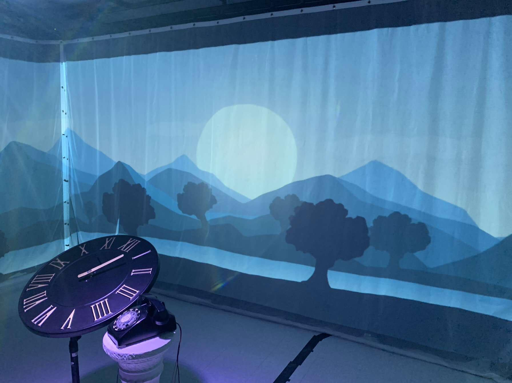
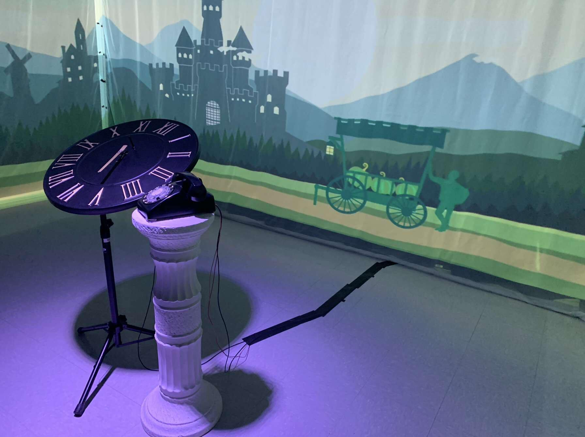
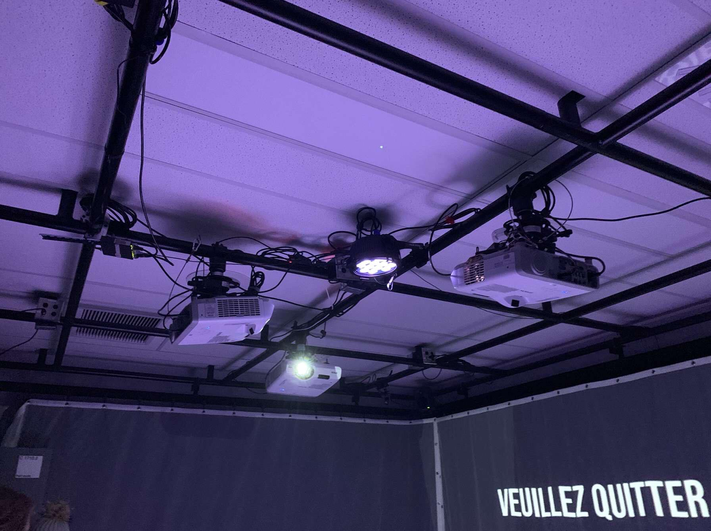
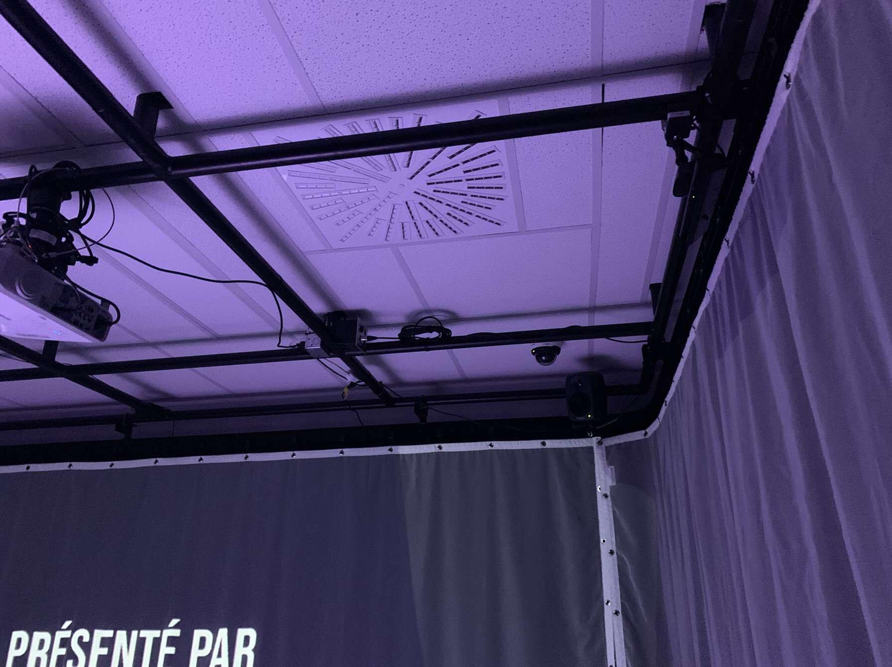
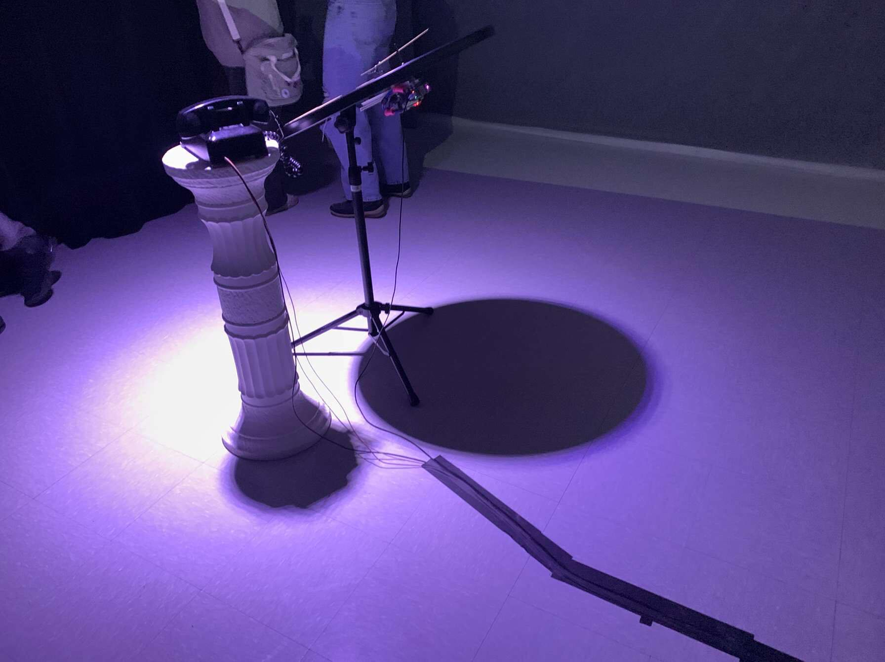

# Titre de l'oeuvre ou de la réalisation
## l'horloge de l'apocalypse

# Nom de l'artiste ou de la firme

## Maloney khim, Sounthida Kong, Olivier Lalonde, Rebecca Pilotte, Émilie Fontaine

# Année de réalisation

## 2022

# Nom de l'exposition ou de l'événement

## Moebius

# Lieu de mise en exposition

## Collège Montmorency

# Date de votre visite

## 23 mars

# Description de l'oeuvre ou du dispositif multimédia

## L’horloge de l’apocalypse représente la ligne du temps de l’humanité. Selon le concept de l’horloge, il est présentement 11 h 58 et il reste 2 minutes avant la fin de l’humanité. À travers ce projet, l’interacteur est invité à contrôler l’horloge grâce aux aiguilles et ainsi manipuler la ligne du temps. Au cours de l’expérience, vous pourrez vivre les différentes époques auxquelles la terre a été exposée. Vous serez exposé aux différents enjeux actuels à travers la projection qui vous entourera et par le fait même vous plongera dans une immersion totale.

ce texte est tiré du site https://tim-montmorency.com/2022/projets/L-horloge-de-l-apocalypse/docs/web/index.html

# Explications sur la mise en espace de l'oeuvre ou du dispositif (texte à composer)

## Quand on rentre au local. On aperçoit une horloge qui se tient sur un piédestal ainsi qu'un téléphone à côté. On aperçoit aussi autour du local des toiles blanches sur les murs. Le local est d'ailleurs sombre dès le départ.Lorsque l'utilisateur interagit avec les aiguilles de l'horloge, des animations s'ouvrent en même temps que la musique et des sons.Le local n'est plus obscur et devient lumineux. À chaque fois qu'on interagit avec les aiguilles, les jeux de lumière changent ainsi que la musique, les sons, et les animations.À la fin, on aperçoit une projection de nous-mêmes sur les toiles.À la toute fin, lorsque l'exposition est finie, ça s'affiche le nom des créateurs et du projet.

# Liste des composantes et techniques de l'oeuvre ou du dispositif (ex. : réalité virtuelle, projecteurs, caméra USB, anneau lumineux...)

## l'oeuvre  utilise 3 projecteurs pour pouvoir projecter et diffuser les séquences d'animations  sur les toiles.

## L'oeuvre contient aussi  des projecteurs à faisceau  accrochés au plafond ainsi que des fils de branchements qui se relient tous par un ordinateur. Il y a aussi des câbles de branchements qui sont sur le plancher.  

 

# Liste des éléments nécessaires pour la mise en exposition (ex. : crochets, sac de sable, câbles de soutien...)

## Évidemment, il était nécessaire que l'oeuvre contienne des projecteurs.Sinon,  il n'y aurait aucune projection sur les toiles et on n’aurait pas pu voir les séquences d'animations.Il est aussi nécessaire qu'il y ait les câbles de sons pour que le son puisse sortir des haut-parleurs.  De plus , le quadriphonique est nécessaire vu que les enregistrements de sons doivent se faire sur un logiciel sonore.

# EXPÉRIENCE VÉCUE :

## J'ai  apprécié l'interactivité des aguilles et du téléphone avec les séquences vidéo d'animations. J'ai trouvé ça vraiment immersif et l'on se sentait comme si l'on rentrait dans un tout nouvel univers. L'oeuvre était simple et efficace. J'ai  apprécié  les dispositifs qui s'enclenchaient simultanément.

# Ce qui vous a plu vous a donné des idées et justifications

## Comme je l'ai dit, c'était l'interactivité, l'immersion et le côté créatif artistique des animations que j'ai vraiment appréciées. Car tous étaient jour en même temps et c'est ce qui rendait l'expérience agréable.

# Aspect que vous ne souhaiteriez pas retenir pour vos propres créations ou que vous feriez autrement et justifications

## je ne pense pas qu'il y ait  de point négatif dans le projet. C'était ben fait. Peut-être que j'aurai par contre  varié le style graphique des animations, car ils avaient tous le même salé. J'aurai apprécié qu'ils soient différents.

