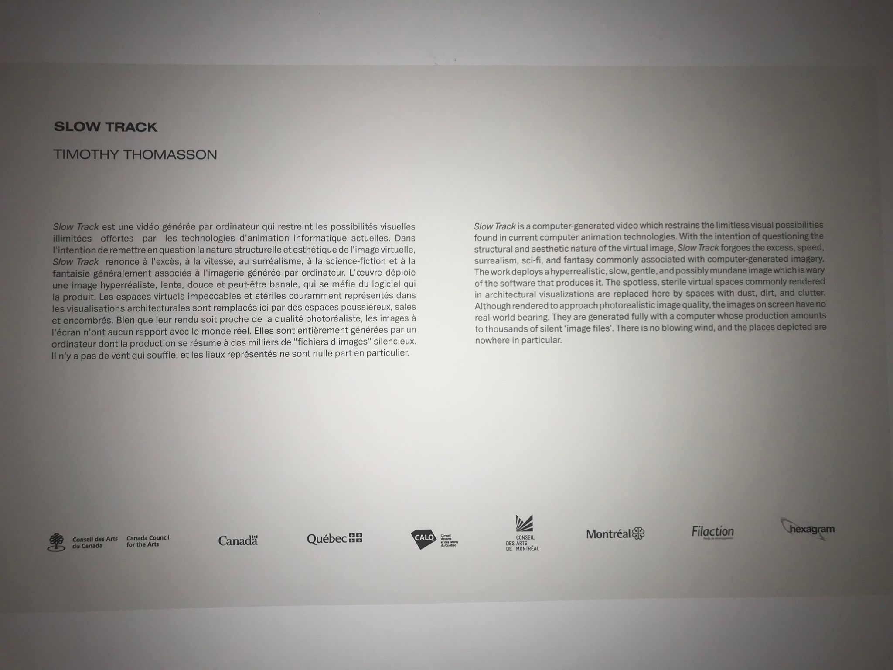
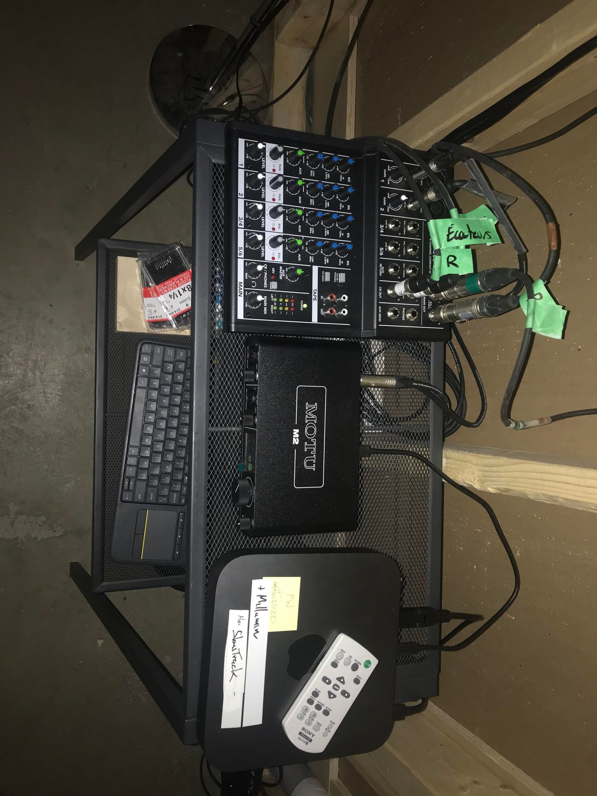
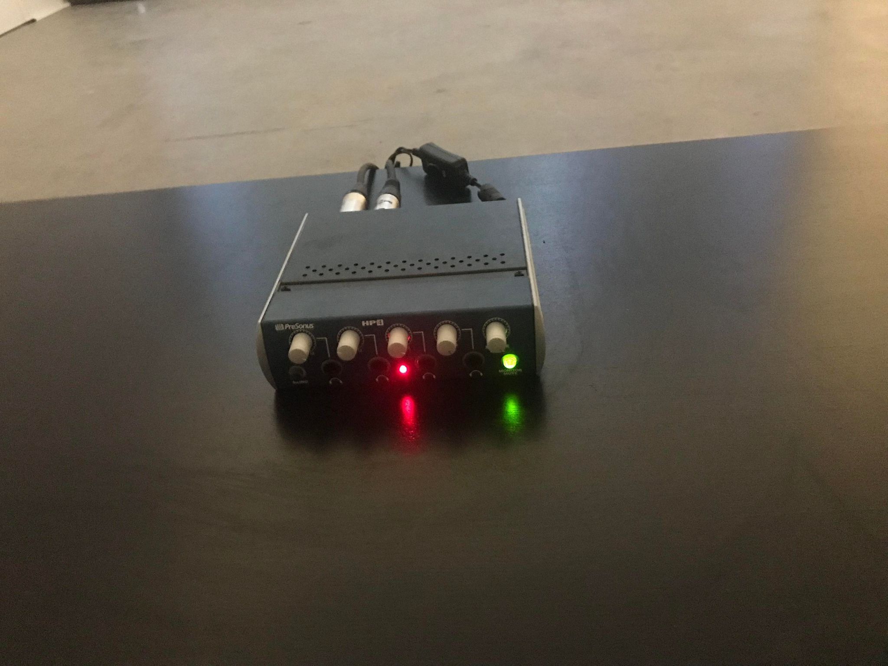
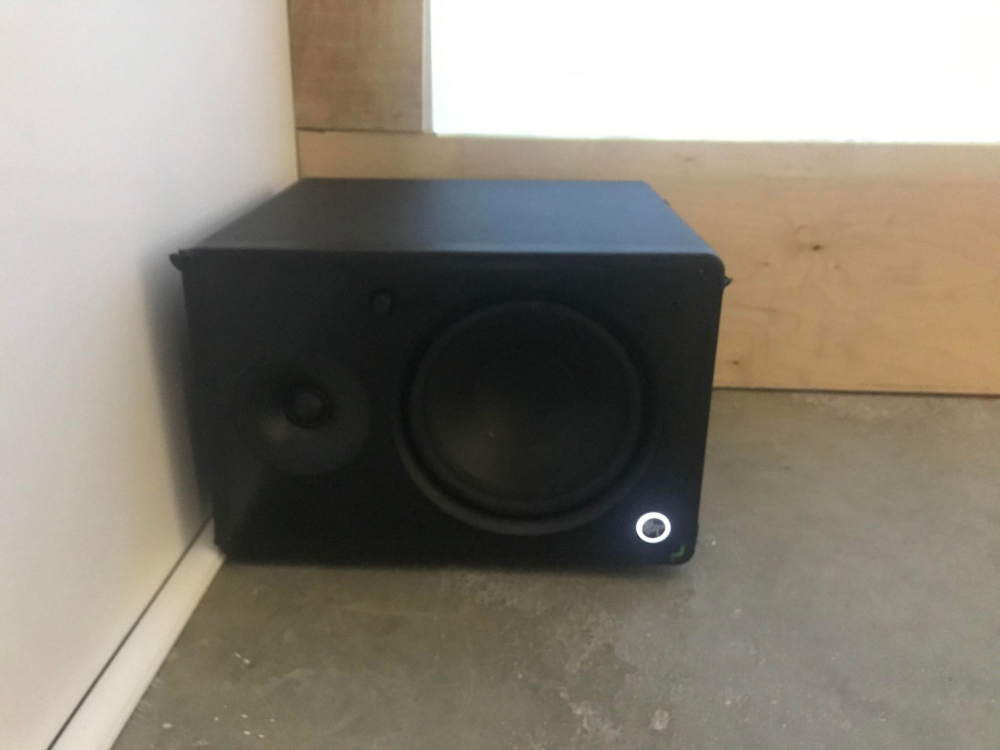
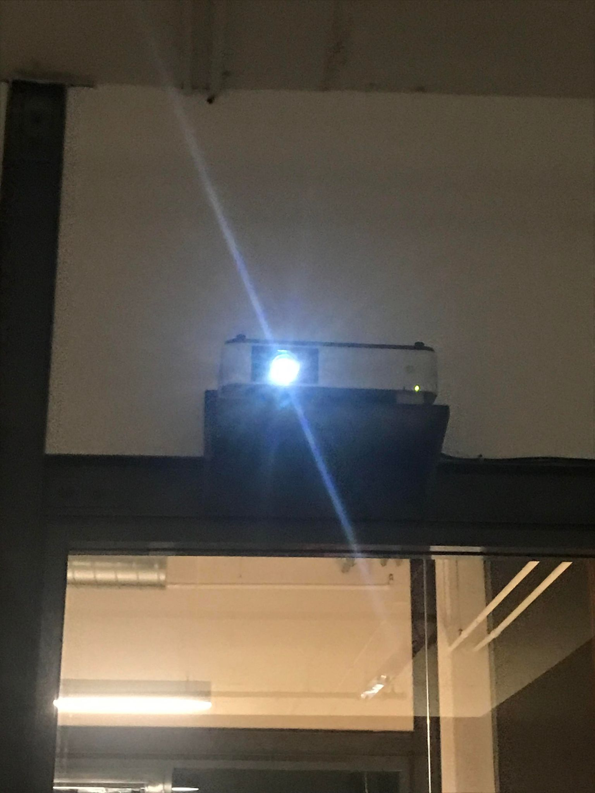

# Titre de l'oeuvre ou de la réalisation
## Slow Track
# Nom de l'artiste ou de la firme
## Timothy Thomasson
# Année de réalisation
##2022
# Nom de l'exposition ou de l'événement
## Slow Track

# Lieu de mise en exposition

## Complexe de Gaspé, 5445 de Gaspé Avenue, Gallery Electra

# Date de votre visite

## 15 avril 2022

# Description de l'oeuvre ou du dispositif multimédia 

 # Explications sur la mise en espace de l'oeuvre ou du dispositif
 
 ## slow track est  une oeuvre visuelle immersive qui utilise l'animation 3d pour diffuser des séquences vidéo en ralenti. Les images qui passent ont pour but d'exprimer l'ancien cinéma classique où l'on voyait autrefois des séquences vidéo très lentes dans des films. D'ailleurs, ces images font aussi la représentation d'espaces ancienne et anachronique. Ces images ressemblent au réel, mais elles ne le sont pas. Ce sont des milliers de fichiers d'images collés ensemble qui forment l'objet ou les décors dans la scène. Cette vidéo s'accompagne de sons très silencieux qui accompagnent les séquences vidéo.

# Liste des composantes et techniques de l'oeuvre ou du dispositif 

## l'oeuvre utilise du matériel sonore pour gérer le son ainsi qu'un système de projection relié à l'ordinateur de marque Apple.

## elle utilise aussi une carte de son de marque Presonus pour émettre le son hors des haut-parleurs.

## L'oeuvre dispose aussi des systèmes de son comme des enceintes pour projeter le son.

## L'oeuvre utilise un projecteur numérique pour diffuser les séquences vidéo sur un fond blanc.

 # Liste des éléments nécessaires pour la mise en exposition 
 
 ## Pour que l'oeuvre soit entièrement fonctionnelle, il fallait qu'elle dispose nécessairement de tout le matériel technique qu'on a cité tout au  début. De plus , il fallait nécerrairement qu'il y ait des câbles de branchements HDMI,USB, vga,des adaptateurs et d'un fond blanc.
 
 
 
# EXPÉRIENCE VÉCUE :

 ## C'était une expérience visuelle et auditive assez calme. Les gens s'assoient devant la diffusion numérique et apprécient les diffusions vidéo au ralenti de lieux et d'objet.Cependant, je trouve qu'il y aurait fallu ajouter plus de détails et plus d'animations durant les diffusions. Le contenu était assez vide. L'espace auquel j'étais était neutre. J'aurai apprécié elles s'animent en même temps que les vidéos exemple: jeux de lumières et de sons.
 
# Ce qui vous a plu vous a donné des idées et justifications

## J'ai aimé comment les objets et les lieux étaient faits. On aurait cru vraiment du réel alors qu'en fait ce n'était que de la 3d. J'étais vraiment impressionné du résultat.

# Aspect que vous ne souhaiteriez pas retenir pour vos propres créations ou que vous feriez autrement et justifications

## Pour mes prochaines créations, je préférerai mieux ne pas prendre l'idée du ralenti. Car ça rendrait mes oeuvres trop lentes et banales à contempler.

